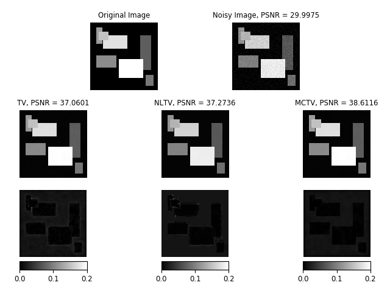

# 2D-MCTV-Denoising
This is the source code for "Minmax-concave Total Variation Denoising" (2D case).

## Paper
Du, H. & Liu, Y. **Minmax-concave Total Variation Denoising**.

*Signal, Image and Video Processing* (2018).

doi: 10.1007/s11760-018-1248-2

url: <https://link.springer.com/article/10.1007/s11760-018-1248-2>

## Prerequisite
- Python 3
- numpy
- scipy
- skimage
- matplotlib

## Usage
- For demonstration, you can simply clone the repository and run `main.py`. Denoising results as well as error images of three methods TV, NLTV and MCTV are plotted. Below is one demo figure.

- The demo 2D 256 × 256 synthetic block image and the corresponding noisy one are saved as `image.mat` and `noi_image.mat`, respectively. One thing I should point out is that the noisy image was generated by function `imnoise` in MATLAB. One reason I choose this function is that, after adding noise, it truncates outliers, and the pixel values stay within proper range (e.g., for gray image, the pixel range is [0, 1]). 

- Feel free to explore and modify all parameter values in `main.py`. For detailed explanation of each parameter and its proper value range, please see the comment in code. 

- For MATLAB version of the source code, you can email me: <yilinl2@andrew.cmu.edu>.

- I followed the instruction and used the source code of "Bregmanized Nonlocal Regularization for Deconvolution and Sparse Reconstruction" to get the NLTV denoising result (paper url: <https://doi.org/10.1137/090746379>), and saved it as `NLTV.jpg`. It greatly facilitates my coding process. You may download the source code from the author Xiaoqun Zhang's homepage, or here: <http://math.sjtu.edu.cn/faculty/xqzhang/html/code.html>.

- For more algorithm details, please see `tv2d.py` and `mctv2d.py` or the relevant research paper.